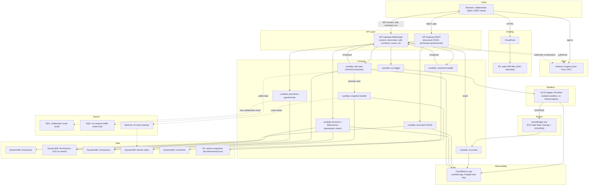

# Architecture

```mermaid
flowchart TB
    subgraph Client
        Browser["Browser: collaborative editor (CRDT client)"]
    end

    subgraph Auth
        Cognito["Amazon Cognito (User Pool, JWT)"]
    end

    subgraph Hosting
        CF["CloudFront"] --> S3Static["S3: static SPA files (OAC restricted)"]
    end

    subgraph API Layer
        RESTAPI["API Gateway REST\n(document CRUD, permission grant/revoke)"]
        WSAPI["API Gateway WebSocket\nconnect, disconnect, edit, comment, cursor, run"]
    end

    subgraph Compute
        LambdaCRUD["Lambda: document CRUD"]
        LambdaPerm["Lambda: permission grant/revoke"]
        LambdaConn["Lambda: $connect / $disconnect\n(permission check)"]
        LambdaEdit["Lambda: edit relay (PostToConnection)"]
        LambdaComment["Lambda: comment handler"]
        LambdaSnapshot["Lambda: snapshot handler"]
        LambdaRunTrigger["Lambda: run trigger"]
        LambdaRunResult["Lambda: run result"]
    end

    subgraph Sandbox
        Fargate["ECS Fargate: RunTask\nisolated sandbox, no internet egress"]
    end

    subgraph Events
        EB["EventBridge rule\nECS Task State Change = STOPPED"]
    end

    subgraph Data
        DDBDocs["DynamoDB: Documents"]
        DDBPerm["DynamoDB: Permissions (GSI on userId)"]
        DDBConn["DynamoDB: Connections"]
        DDBVersion["DynamoDB: Version index"]
        DDBComments["DynamoDB: Comments"]
        S3Versions["S3: version snapshots (docId/versionId.json)"]
    end

    subgraph Observability
        CWLogs["CloudWatch Logs\nLambda logs, Fargate task logs"]
    end

    subgraph Stretch
        SES["SES: collaborator invite email"]
        SQS["SQS: run-request buffer under load"]
        Bedrock["Bedrock: AI code reviewer"]
    end

    Browser -->|sign in| Cognito
    Browser -->|HTTPS| CF
    Browser -->|REST calls| RESTAPI
    Browser <-->|WS connect, edit, comment, run| WSAPI

    RESTAPI -.->|authorizer| Cognito
    WSAPI -.->|authorizer on $connect| Cognito

    RESTAPI --> LambdaCRUD --> DDBDocs
    RESTAPI --> LambdaPerm --> DDBPerm
    LambdaPerm -.->|new collaborator email| SES

    WSAPI --> LambdaConn --> DDBConn
    LambdaConn --> DDBPerm

    WSAPI --> LambdaEdit
    LambdaEdit --> DDBConn
    LambdaEdit -->|broadcast| WSAPI

    WSAPI --> LambdaComment --> DDBComments
    LambdaComment -->|broadcast| WSAPI

    LambdaEdit -.->|periodic save| LambdaSnapshot
    LambdaSnapshot --> S3Versions
    LambdaSnapshot --> DDBVersion
    LambdaSnapshot -.->|code review| Bedrock
    Bedrock -.-> DDBVersion

    WSAPI --> LambdaRunTrigger
    LambdaRunTrigger -.->|under load| SQS
    LambdaRunTrigger --> Fargate

    Fargate --> CWLogs
    Fargate -->|STOPPED| EB
    EB --> LambdaRunResult
    LambdaRunResult --> CWLogs
    LambdaRunResult -->|result| WSAPI

    LambdaCRUD --> CWLogs
    LambdaConn --> CWLogs
    LambdaEdit --> CWLogs
```