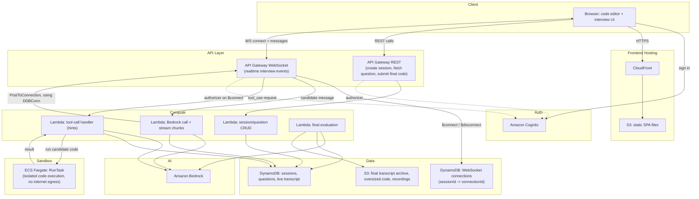

# Architecture

```mermaid
flowchart TB
    subgraph Client
        Browser["Browser: code editor + interview UI"]
    end

    subgraph Auth
        Cognito["Amazon Cognito"]
    end

    subgraph Frontend Hosting
        CF["CloudFront"] --> S3Static["S3: static SPA files"]
    end

    subgraph API Layer
        RESTAPI["API Gateway REST\n(create session, fetch question, submit final code)"]
        WSAPI["API Gateway WebSocket\n(realtime interview events)"]
    end

    subgraph Compute
        LambdaCRUD["Lambda: session/question CRUD"]
        LambdaStream["Lambda: Bedrock call + stream chunks"]
        LambdaTool["Lambda: tool-call handler (hints)"]
        LambdaEval["Lambda: final evaluation"]
    end

    subgraph AI
        Bedrock["Amazon Bedrock"]
    end

    subgraph Sandbox
        Fargate["ECS Fargate: RunTask\n(isolated code execution, no internet egress)"]
    end

    subgraph Data
        DDBSessions["DynamoDB: sessions, questions, live transcript"]
        DDBConn["DynamoDB: WebSocket connections\n(sessionId -> connectionId)"]
        S3Archive["S3: final transcript archive, oversized code, recordings"]
    end

    Browser -->|sign in| Cognito
    Browser -->|HTTPS| CF
    Browser -->|REST calls| RESTAPI
    Browser <-->|WS connect + messages| WSAPI

    RESTAPI --> LambdaCRUD
    LambdaCRUD --> DDBSessions

    WSAPI -->|"$connect / $disconnect"| DDBConn
    WSAPI -->|candidate message| LambdaStream
    WSAPI -->|tool_use request| LambdaTool

    LambdaStream --> Bedrock
    LambdaStream -->|PostToConnection, using DDBConn| WSAPI
    LambdaStream --> DDBSessions

    LambdaTool --> Bedrock
    LambdaTool --> DDBSessions
    LambdaTool -->|run candidate code| Fargate
    Fargate -->|result| LambdaTool

    LambdaEval --> Bedrock
    LambdaEval --> DDBSessions
    LambdaEval --> S3Archive

    RESTAPI -.->|authorizer| Cognito
    WSAPI -.->|authorizer on $connect| Cognito
```